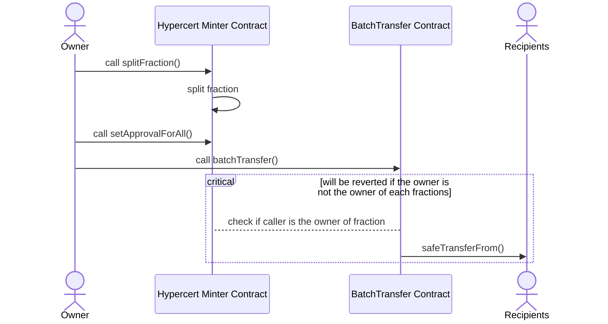

# Hypercerts Periphery Contracts

[](https://github.com/hypercerts-org/protocol-periphery/actions/workflows/test.yml)
[](https://github.com/hypercerts-org/protocol-periphery/actions/workflows/slither.yaml)

## Implementation

### BatchTransferFraction

```solidity
    /// @dev msg.sender must be the owner of all the fraction IDs being transferred
    /// @dev msg.sender must have approved the contract to transfer the fractions
    /// @dev The length of recipients and fractionIds must be the same
    /// @param data The encoded data containing the recipients and fraction IDs
    function batchTransfer(bytes memory data) external {
        require(data.length > 0, INVALID_DATA());
        TransferData memory transferData = abi.decode(data, (TransferData));
        require(transferData.recipients.length == transferData.fractionIds.length, INVALID_LENGTHS());

        _batchTransfer(transferData.recipients, transferData.fractionIds);
    }

    /// @notice Transfers fractions to multiple recipients
    /// @dev The length of recipients and fractionIds must be the same
    /// @dev The caller must be the owner of all the fraction IDs being transferred
    /// @param recipients The addresses of the recipients
    /// @param fractionIds The IDs of the fractions to be transferred
    function _batchTransfer(address[] memory recipients, uint256[] memory fractionIds) internal {
        for (uint256 i = 0; i < recipients.length; i++) {
            address recipient = recipients[i];
            uint256 fractionId = fractionIds[i];
            require(hypercertToken.ownerOf(fractionId) == msg.sender, INVALID_CALLER(msg.sender));

            hypercertToken.safeTransferFrom(msg.sender, recipient, fractionId, 1, "");
        }
    }
```
