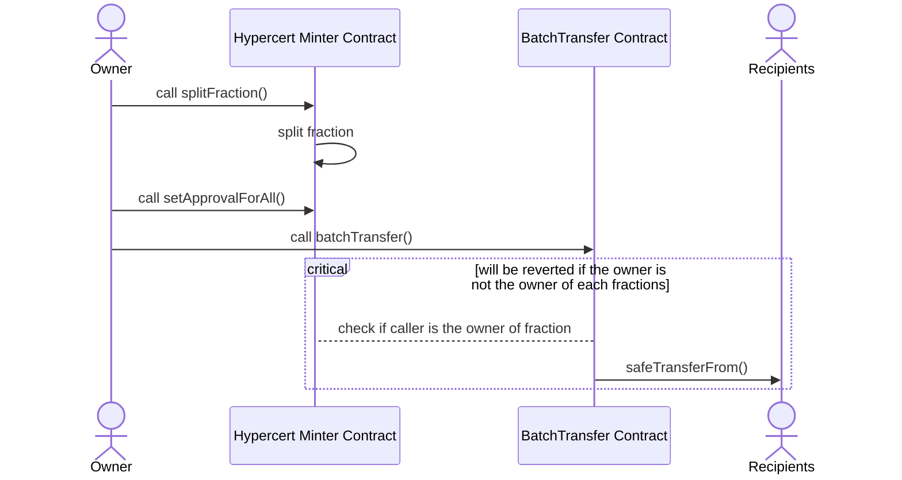

# Hypercerts Periphery Contracts

[](https://github.com/hypercerts-org/protocol-periphery/actions/workflows/test.yml)
[](https://github.com/hypercerts-org/protocol-periphery/actions/workflows/slither.yaml)

## Implementation

### BatchTransferFraction



```solidity
    /// @dev msg.sender must be the owner of all the fraction IDs being transferred
    /// @dev msg.sender must have approved the contract to transfer the fractions
    /// @dev The length of recipients and fractionIds must be the same
    /// @param data The encoded data containing the recipients and fraction IDs
    function batchTransfer(bytes memory data) external {
        require(data.length > 0, INVALID_DATA());
        TransferData memory transferData = abi.decode(data, (TransferData));
        require(transferData.recipients.length == transferData.fractionIds.length, INVALID_LENGTHS());

        _batchTransfer(transferData.recipients, transferData.fractionIds);
    }

    /// @notice Transfers fractions to multiple recipients
    /// @dev The length of recipients and fractionIds must be the same
    /// @dev The caller must be the owner of all the fraction IDs being transferred
    /// @param recipients The addresses of the recipients
    /// @param fractionIds The IDs of the fractions to be transferred
    function _batchTransfer(address[] memory recipients, uint256[] memory fractionIds) internal {
        for (uint256 i = 0; i < recipients.length; i++) {
            address recipient = recipients[i];
            uint256 fractionId = fractionIds[i];
            require(hypercertToken.ownerOf(fractionId) == msg.sender, INVALID_CALLER(msg.sender));

            hypercertToken.safeTransferFrom(msg.sender, recipient, fractionId, 1, "");
        }
    }
```

## Deployments

### BatchTransferFraction

| chain            | chainId  | address                                                                                                                          |
| ---------------- | -------- | -------------------------------------------------------------------------------------------------------------------------------- |
| Sepolia          | 11155111 | [0x59e07f1cc8eb8eca2703179a7217673318a0fe47](https://sepolia.etherscan.io/address/0x59e07f1cc8eb8eca2703179a7217673318a0fe47)    |
| Base Sepolia     | 84532    | [0x3C0FaAA04078d715BB05Af82Ca99c41623AeC5Ae](https://sepolia.basescan.org/address/0x3C0FaAA04078d715BB05Af82Ca99c41623AeC5Ae)    |
| Arbitrum Sepolia | 421614   | [0x0fCCa2bAd3103934304874E782450688B7a044B0](https://sepolia.arbiscan.io/address/0x0fCCa2bAd3103934304874E782450688B7a044B0)     |
| Optimism         | 10       | [0xf77e452ec289da0616574aae371800ca4d6315b1](https://optimistic.etherscan.io/address/0xf77e452ec289da0616574aae371800ca4d6315b1) |
| Base             | 8453     | [0xc4aEB039BC432343bf4dB57Be203E0540d385a18](https://basescan.org/address/0xc4aEB039BC432343bf4dB57Be203E0540d385a18)            |
| Arbitrum         | 42161    | [0x8b973c408c2748588b3ECFfDA06D670819FbEb1D](https://arbiscan.io/address/0x8b973c408c2748588b3ECFfDA06D670819FbEb1D)             |
| Celo             | 42220    | [0xB64B7e4793D72958e028B1D5D556888b115c4c3E](https://celoscan.io/address/0xB64B7e4793D72958e028B1D5D556888b115c4c3E)             |
